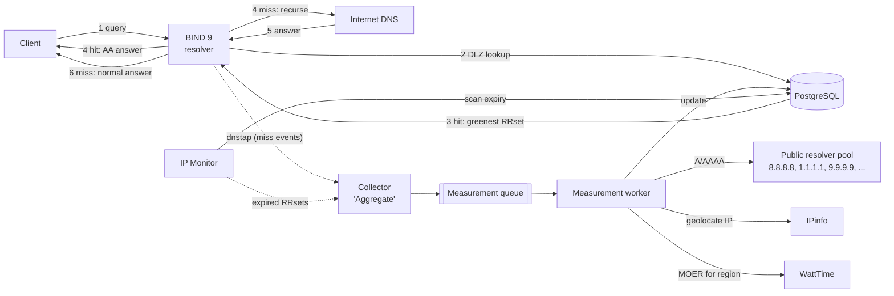

# CA-DNS Architecture

Carbon-Aware DNS (CA-DNS) is a recursive resolver that implements the
**Multi-Resolver Greenest** selection strategy from *Leveraging DNS for
Carbon-Aware Server Selection* (Shakeri et al., 2026): for each domain it
merges the RRsets returned by several upstream public resolvers, attributes a
Marginal Operational Emission Rate (MOER) to every endpoint, and answers
clients with the lowest-MOER address(es).

It is inspired by [ActiveDNS](https://github.com/MhrshadSh/ActiveDNS), which
uses BIND 9 + PostgreSQL DLZ to answer with the lowest-RTT address.

## 1. Request flow




| Step | Hit (fresh entry in DB) | Miss (no/expired entry) |
|------|-------------------------|-------------------------|
| 1 | Client sends A/AAAA query to BIND | same |
| 2 | BIND's DLZ module asks PostgreSQL whether a fresh RRset exists for the qname | same |
| 3 | PostgreSQL returns the lowest-MOER address(es) | nothing found |
| 4 | BIND answers authoritatively (AA) from DLZ | BIND resolves recursively; the miss is reported to the collector, which enqueues the domain |
| 5–6 | — | BIND returns the normal recursive answer |

The first query for a domain is answered normally; later queries (after the
worker has measured it) receive the carbon-aware answer.

## 2. Components

| Component | Tech | Responsibility |
|-----------|------|----------------|
| **resolver** | BIND 9.20 (ESV) + custom `dlz_pgsql` dlopen module (C, libpq) | Serve hits from PostgreSQL, recurse on misses, emit dnstap |
| **postgres** | PostgreSQL 18 | RRsets, endpoints, geolocation, carbon signals, measurement queue; answer policy lives in SQL functions |
| **collector** ("Aggregate") | Python, dnstap reader | Turn resolver misses into queue entries; record query activity for hits |
| **monitor** ("IP Monitor") | Python | Re-enqueue expired RRsets of active domains; refresh MOER per grid region; garbage-collect inactive domains |
| **worker** ("Measurement Worker") | Python (asyncio) | Resolve via upstream pool, geolocate, attach MOER, upsert results |

All run as services in one `docker compose` project. The Python services share
one package (`cadns`) and one image with different entrypoints.

## 3. Key design decisions

### ADR-1: BIND 9.20 with a custom PostgreSQL DLZ *dlopen* module

ActiveDNS builds BIND 9.11 with `--with-dlz-postgres`. That version is
end-of-life, and the compiled-in DLZ drivers no longer exist in current BIND.
ISC's maintained [dlz-modules](https://gitlab.isc.org/isc-projects/dlz-modules)
repository has MySQL, SQLite3, LDAP, etc. — **but no PostgreSQL module**.

Decision: write our own `dlz_pgsql.so` against the stable `dlz_minimal.h`
API (DLZ_DLOPEN_VERSION 3). It only needs libpq, not BIND's headers, so we can
run it on the official ISC BIND 9.20 image without compiling BIND.

Benefits over ActiveDNS's approach:
- Parameterised queries (`PQexecPrepared`) instead of `'$zone$'` string
  substitution, which is SQL-injectable from the network.
- Connection pool + `DNS_SDLZFLAG_THREADSAFE`, so lookups are not serialised.
- The module calls two SQL functions (`cadns.dlz_findzone`, `cadns.dlz_lookup`);
  the selection policy can change without recompiling C.

### ADR-2: Detect misses with dnstap, not inside the DLZ lookup

BIND probes the DLZ from the longest name down
(`www.youtube.com` → `youtube.com` → `com`; see `dns_view_searchdlz` in
`lib/dns/view.c`). If "enqueue on miss" ran inside `findzone`, every parent
name would be enqueued too. The module also can't tell which probe is the
client's actual qname.

Decision: keep the DLZ path read-only and fast. BIND streams dnstap
`CLIENT_RESPONSE` messages to the collector. A NOERROR/NXDOMAIN A/AAAA response
**without** the AA bit was answered recursively, which means a miss, so the
collector enqueues the qname. A response **with** AA came from DLZ (a hit), so
the collector updates `last_queried_at`. As a side effect, the query hot path
never writes to the DB.

### ADR-3: The measurement queue is a PostgreSQL table

FIFO ordered by `enqueued_at`, one row per domain (a unique constraint
deduplicates bursts of misses), consumed with `SELECT … FOR UPDATE SKIP LOCKED`,
and workers are woken with `LISTEN/NOTIFY`. It supports retries with
backoff and a dead-letter state. There's no extra broker to run. Redis Streams
can replace it later behind the same `Queue` interface if throughput requires.

### ADR-4: Normalised carbon data; MOER joined at answer time

Endpoints map to a grid region, and MOER is stored **per region**, refreshed
every 5 minutes (WattTime's granularity). The answer query joins the latest
MOER, so a region's carbon change affects all its endpoints immediately
without re-resolving domains. This also minimises API calls, because many IPs share
a few regions.

### ADR-5: Answer policy (default, configurable)

Implemented in SQL (`db/migrations/0002_dlz_functions.sql`); knobs live in the
single-row `cadns.settings` table, so they change without a migration.

- **Serve or recurse** (`dlz_findzone`): answer authoritatively only if the name
  has stored A/AAAA data **and every stored RRset type still has a fresh record**.
  If AAAA has expired while A is fresh, serving the zone would turn AAAA
  queries into authoritative NODATA and break IPv6 clients, so the name falls
  back to recursion until it is re-measured.
- **Candidates:** union of fresh A (or AAAA) records from all upstream resolvers,
  one row per address (an address stays valid while any resolver's record does).
- **Order:** latest MOER of the endpoint's region, ascending. Unknown MOER ranks
  last: no geolocation, no region, no carbon signal, or anycast. Ties are broken randomly.
- **Selection:** the top `answer_k` addresses per type (default 1, as in the paper).
  If every candidate is unknown, CA-DNS still answers (equivalent to the random baseline).
- **TTL:** per RRset, `min(remaining TTL of the returned records, max_answer_ttl)`,
  at least 1 s. `max_answer_ttl` defaults to 300 s (the carbon refresh interval).
- **SOA/NS at `@`:** synthesised from `settings.ns_name` / `hostmaster`. Their TTL
  and the SOA minimum equal the smallest RRset TTL, so negative answers never
  outlive the data. The serial is the latest `resolved_at` as a Unix timestamp.
  Child names (`x.www.example.com`) have no records (NXDOMAIN; see §5).
- Names are matched case-insensitively and without trailing dot (BIND may pass
  0x20-randomised case).
- Later options: weighted random selection (the paper's load-balancing mitigation), an
  RTT guard.

### ADR-6: Plain SQL migrations applied by a one-shot container

Migrations are ordered `db/migrations/NNNN_name.sql` files baked into the
`cadns-migrate` image (built from the same `postgres` image as the server, so
`psql` matches). `make up` runs it before starting services; later services
depend on it with `service_completed_successfully`.

- Each file runs in one transaction together with its row in
  `public.schema_migrations` (version + SHA-256). Editing an applied migration
  is an error: add a new one instead.
- Roles are created `NOLOGIN` in SQL (no secrets in the repo). After migrating,
  the runner sets `LOGIN` + passwords from `CADNS_DLZ_PASSWORD` / `CADNS_APP_PASSWORD`.
- No migration framework: the schema is small, and SQL functions are the
  product here, so plain SQL keeps them reviewable.

### ADR-7: Integration tests run in a container on the backend network

PostgreSQL has no published port (the `backend` network is internal), so
tests run in a `tests` compose service (profile `test`, `make test`): a uv
project in `tests/` with pytest + psycopg. Each test works inside a transaction
that is rolled back, so tests never disturb the dev database or each other,
and `now()` is fixed for the whole test, which makes TTL checks exact.

## 4. Data model

Schema `cadns`, defined in `db/migrations/0001_init.sql` (the source of truth):

```
settings         (singleton PK, answer_k, max_answer_ttl, ns_name, hostmaster, updated_at)
domains          (id PK, name UNIQUE, status, first_seen_at, measured_at,
                  last_queried_at, hit_count)
                  status ∈ {pending, resolved, nxdomain, nodata, failed}
rrset_records    (domain_id FK, rtype {A, AAAA}, address FK→endpoints, resolver INET,
                  ttl, resolved_at, expires_at, PK(domain_id, rtype, address, resolver))
endpoints        (address INET PK, lat, lon, city, country, asn, is_anycast,
                  region_code FK, geo_source, geo_updated_at)
grid_regions     (code PK, name, provider)
carbon_signals   (region_code FK, point_time, moer_g_per_kwh, fetched_at,
                  PK(region_code, point_time))              -- latest point per region used
measurement_queue(domain PK, reason {miss, expired}, state {pending, dead}, enqueued_at,
                  attempts, next_attempt_at, locked_by, locked_at, last_error)
```

Constraints keep the data canonical: domain names are lowercase without
trailing dot; A records hold IPv4 host addresses and AAAA records IPv6 ones;
MOER is stored in gCO2/kWh (WattTime reports lbs/MWh; the worker converts).
Every endpoint referenced by a record has an `endpoints` row, even before it
is geolocated.

DB roles: `cadns_dlz` may only `EXECUTE` the two DLZ functions (they are
`SECURITY DEFINER`; the role has no table privileges); `cadns_app` has DML on
all tables and is used by the Python services; migrations run as the owner.

## 5. Known risks (validated early, in the Phase 2 spike)

| Risk | Why | Mitigation to evaluate |
|------|-----|------------------------|
| DLZ makes BIND authoritative for the **whole name** | A hit on `www.youtube.com` means queries for other types there (e.g. HTTPS, TXT) get NODATA, and children like `x.www.youtube.com` get NXDOMAIN | Measure real impact. `findzone` succeeds only for names with fresh data. Possibly synthesise referrals for non-served types/children, or accept and document |
| Authoritative negative answers need SOA/NS | BIND expects apex SOA/NS in a DLZ zone | `dlz_lookup` synthesises SOA + NS at `@` |
| CNAME flattening | We answer A records directly at the qname | Intended; TTL is the minimum over the chain |
| DNSSEC | Synthesised answers can't carry valid signatures | Serve only to non-validating stubs; never set AD; document |
| WattTime access tier | Free tier gives absolute MOER only for CAISO_NORTH; other regions only a relative index that can't be compared across regions | Research/paid account available. Still rate-limit, and cache per region |
| IPinfo tier | WattTime needs lat/lon; IPinfo Lite has country/ASN only | Research/paid access available: city-level MMDB (primary), API (fallback) |
| Anycast endpoints | IP geolocation is unreliable for anycast | v1: flag via anycast census prefixes and rank as unknown; later: traceroute-based location as in the paper |
| Upstream vantage point | Public anycast resolvers answer for *their* PoP near the container, not the client | Deploy close to clients; ECS support later |
| Open resolver | Recursive + public port 53 | `allow-recursion` / `allow-query` ACLs by default |
| DLZ functions owned by a superuser | The `SECURITY DEFINER` functions run as the migration owner, which is the image's superuser in dev | Phase 6: dedicated non-superuser owner role |
