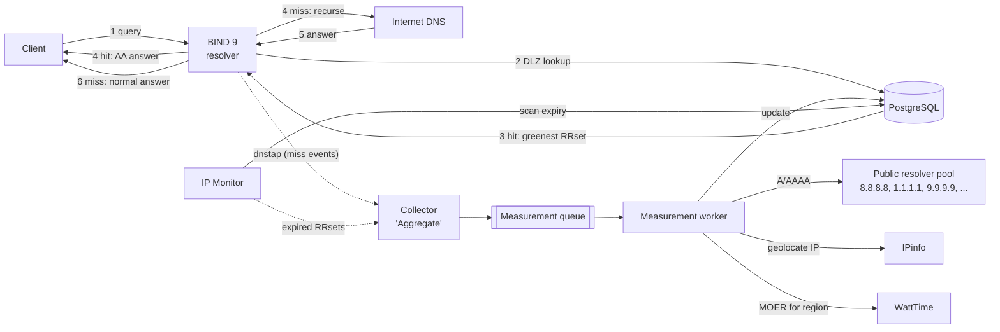

# CA-DNS Architecture

Carbon-Aware DNS (CA-DNS) is a recursive resolver that implements the
**Multi-Resolver Greenest** selection strategy from *Leveraging DNS for
Carbon-Aware Server Selection* (Shakeri et al., 2026): for each domain it
merges the RRsets returned by several upstream public resolvers, attributes a
Marginal Operational Emission Rate (MOER) to every endpoint, and answers
clients with the lowest-MOER address(es).

It is inspired by [ActiveDNS](https://github.com/MhrshadSh/ActiveDNS), which
uses BIND 9 + PostgreSQL DLZ to answer with the lowest-RTT address.

## 1. Request flow



| Step | Hit (fresh entry in DB) | Miss (no/expired entry) |
|------|-------------------------|-------------------------|
| 1 | Client sends A/AAAA query to BIND | same |
| 2 | BIND's DLZ module asks PostgreSQL whether a fresh RRset exists for the qname | same |
| 3 | PostgreSQL returns the lowest-MOER address(es) | nothing found |
| 4 | BIND answers authoritatively (AA) from DLZ | BIND resolves recursively; the miss is reported to the collector, which enqueues the domain |
| 5–6 | — | BIND returns the normal recursive answer |

The first query for a domain is answered normally; later queries (after the
worker has measured it) receive the carbon-aware answer.

## 2. Components

| Component | Tech | Responsibility |
|-----------|------|----------------|
| **resolver** | BIND 9.20 (ESV) + custom `dlz_pgsql` dlopen module (C, libpq) | Serve hits from PostgreSQL, recurse on misses, emit dnstap |
| **postgres** | PostgreSQL 17 | RRsets, endpoints, geolocation, carbon signals, measurement queue; answer policy lives in SQL functions |
| **collector** ("Aggregate") | Python, dnstap reader | Turn resolver misses into queue entries; record query activity for hits |
| **monitor** ("IP Monitor") | Python | Re-enqueue expired RRsets of active domains; refresh MOER per grid region; garbage-collect inactive domains |
| **worker** ("Measurement Worker") | Python (asyncio) | Resolve via upstream pool, geolocate, attach MOER, upsert results |

All run as services in one `docker compose` project. The Python services share
one package (`cadns`) and one image with different entrypoints.

## 3. Key design decisions

### ADR-1: BIND 9.20 with a custom PostgreSQL DLZ *dlopen* module

ActiveDNS builds BIND 9.11 with `--with-dlz-postgres`. That version is
end-of-life, and the compiled-in DLZ drivers no longer exist in current BIND.
ISC's maintained [dlz-modules](https://gitlab.isc.org/isc-projects/dlz-modules)
repository has MySQL, SQLite3, LDAP, etc. — **but no PostgreSQL module**.

Decision: write our own `dlz_pgsql.so` against the stable `dlz_minimal.h`
API (DLZ_DLOPEN_VERSION 3). It only needs libpq, not BIND's headers, so we can
run it on the official ISC BIND 9.20 image without compiling BIND.

Benefits over ActiveDNS's approach:
- Parameterised queries (`PQexecPrepared`) instead of `'$zone$'` string
  substitution, which is SQL-injectable from the network.
- Connection pool + `DNS_SDLZFLAG_THREADSAFE`, so lookups are not serialised.
- The module calls two SQL functions (`cadns.dlz_findzone`, `cadns.dlz_lookup`);
  the selection policy can change without recompiling C.

### ADR-2: Detect misses with dnstap, not inside the DLZ lookup

BIND probes the DLZ from the longest name down
(`www.youtube.com` → `youtube.com` → `com`; see `dns_view_searchdlz` in
`lib/dns/view.c`). If "enqueue on miss" ran inside `findzone`, every parent
name would be enqueued too. The module also can't tell which probe is the
client's actual qname.

Decision: keep the DLZ path read-only and fast. BIND streams dnstap
`CLIENT_RESPONSE` messages to the collector. A NOERROR/NXDOMAIN A/AAAA response
**without** the AA bit was answered recursively, which means a miss, so the
collector enqueues the qname. A response **with** AA came from DLZ (a hit), so
the collector updates `last_queried_at`. As a side effect, the query hot path
never writes to the DB.

### ADR-3: The measurement queue is a PostgreSQL table

FIFO ordered by `enqueued_at`, one row per domain (a unique constraint
deduplicates bursts of misses), consumed with `SELECT … FOR UPDATE SKIP LOCKED`,
and workers are woken with `LISTEN/NOTIFY`. It supports retries with
backoff and a dead-letter state. There's no extra broker to run. Redis Streams
can replace it later behind the same `Queue` interface if throughput requires.

### ADR-4: Normalised carbon data; MOER joined at answer time

Endpoints map to a grid region, and MOER is stored **per region**, refreshed
every 5 minutes (WattTime's granularity). The answer query joins the latest
MOER, so a region's carbon change affects all its endpoints immediately
without re-resolving domains. This also minimises API calls, because many IPs share
a few regions.

### ADR-5: Answer policy (default, configurable)

- Candidates: union of fresh A (or AAAA) records from all upstream resolvers.
- Order: MOER ascending; endpoints with unknown MOER rank last; ties are broken randomly.
- Return the top `k` addresses (default `k = 1`, as in the paper).
- TTL to client: `min(remaining RRset TTL, carbon refresh interval)`.
- Later options: weighted random selection (the paper's load-balancing mitigation), an
  RTT guard.

## 4. Data model (initial sketch)

```
domains          (id, name UNIQUE, first_seen_at, last_queried_at, hit_count, status)
rrset_records    (domain_id, rtype, address INET, resolver, ttl, resolved_at, expires_at,
                  PK(domain_id, rtype, address, resolver))
endpoints        (address INET PK, lat, lon, city, country, asn, is_anycast,
                  region_code FK, geo_source, geo_updated_at)
grid_regions     (code PK, name, provider)
carbon_signals   (region_code, moer_g_per_kwh, point_time, fetched_at)   -- latest per region used
measurement_queue(domain UNIQUE, reason {miss, expired}, enqueued_at, attempts,
                  next_attempt_at, locked_by, locked_at, last_error)
```

DB roles: `cadns_dlz` may only `EXECUTE` the two DLZ functions (read-only);
`cadns_app` is used by the Python services; migrations run as owner.

## 5. Known risks (validated early, in the Phase 2 spike)

| Risk | Why | Mitigation to evaluate |
|------|-----|------------------------|
| DLZ makes BIND authoritative for the **whole name** | A hit on `www.youtube.com` means queries for other types there (e.g. HTTPS, TXT) get NODATA, and children like `x.www.youtube.com` get NXDOMAIN | Measure real impact. `findzone` succeeds only for names with fresh data. Possibly synthesise referrals for non-served types/children, or accept and document |
| Authoritative negative answers need SOA/NS | BIND expects apex SOA/NS in a DLZ zone | `dlz_lookup` synthesises SOA + NS at `@` |
| CNAME flattening | We answer A records directly at the qname | Intended; TTL is the minimum over the chain |
| DNSSEC | Synthesised answers can't carry valid signatures | Serve only to non-validating stubs; never set AD; document |
| WattTime access tier | Free tier gives absolute MOER only for CAISO_NORTH; other regions only a relative index that can't be compared across regions | Research/paid account available. Still rate-limit, and cache per region |
| IPinfo tier | WattTime needs lat/lon; IPinfo Lite has country/ASN only | Research/paid access available: city-level MMDB (primary), API (fallback) |
| Anycast endpoints | IP geolocation is unreliable for anycast | v1: flag via anycast census prefixes and rank as unknown; later: traceroute-based location as in the paper |
| Upstream vantage point | Public anycast resolvers answer for *their* PoP near the container, not the client | Deploy close to clients; ECS support later |
| Open resolver | Recursive + public port 53 | `allow-recursion` / `allow-query` ACLs by default |
