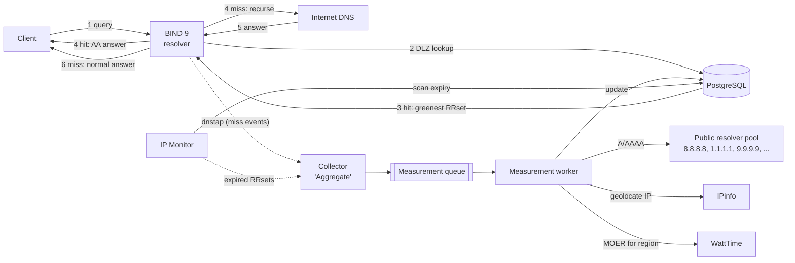

# CA-DNS Architecture

Carbon-Aware DNS (CA-DNS) is a recursive resolver that implements the
**Multi-Resolver Greenest** selection strategy from *Leveraging DNS for
Carbon-Aware Server Selection* (Shakeri et al., 2026): for each domain it
merges the RRsets returned by several upstream public resolvers, attributes a
Marginal Operational Emission Rate (MOER) to every endpoint, and answers
clients with the lowest-MOER address(es).

It is inspired by [ActiveDNS](https://github.com/MhrshadSh/ActiveDNS), which
uses BIND 9 + PostgreSQL DLZ to answer with the lowest-RTT address.

## 1. Request flow




| Step | Hit (fresh entry in DB) | Miss (no/expired entry) |
|------|-------------------------|-------------------------|
| 1 | Client sends A/AAAA query to BIND | same |
| 2 | BIND's DLZ module asks PostgreSQL whether a fresh RRset exists for the qname | same |
| 3 | PostgreSQL returns the lowest-MOER address(es) | nothing found |
| 4 | BIND answers authoritatively (AA) from DLZ | BIND resolves recursively; the miss is reported to the collector, which enqueues the domain |
| 5–6 | — | BIND returns the normal recursive answer |

The first query for a domain is answered normally; later queries (after the
worker has measured it) receive the carbon-aware answer.

## 2. Components

| Component | Tech | Responsibility |
|-----------|------|----------------|
| **resolver** | BIND 9.20 (ESV) + custom `dlz_pgsql` dlopen module (C, libpq) | Serve hits from PostgreSQL, recurse on misses, emit dnstap |
| **postgres** | PostgreSQL 18 | RRsets, endpoints, geolocation, carbon signals, measurement queue; answer policy lives in SQL functions |
| **collector** ("Aggregate") | Python, dnstap reader | Turn resolver misses into queue entries; record query activity for hits |
| **monitor** ("IP Monitor") | Python | Re-enqueue expired RRsets of active domains; refresh MOER per grid region; garbage-collect inactive domains |
| **worker** ("Measurement Worker") | Python (asyncio) | Resolve via upstream pool, geolocate, attach MOER, upsert results |

All run as services in one `docker compose` project. The Python services share
one package (`cadns`) and one image with different entrypoints.

## 3. Key design decisions

### ADR-1: BIND 9.20 with a custom PostgreSQL DLZ *dlopen* module

ActiveDNS builds BIND 9.11 with `--with-dlz-postgres`. That version is
end-of-life, and the compiled-in DLZ drivers no longer exist in current BIND.
ISC's maintained [dlz-modules](https://gitlab.isc.org/isc-projects/dlz-modules)
repository has MySQL, SQLite3, LDAP, etc. — **but no PostgreSQL module**.

Decision: write our own `dlz_pgsql.so` against the stable `dlz_minimal.h`
API (DLZ_DLOPEN_VERSION 3, vendored from dlz-modules commit `068c1e5`, ISC
license). It only needs libpq, not BIND's headers.

**Base image (spike finding):** the official `internetsystemsconsortium/bind9`
images are published for amd64 only, and the dev host is arm64. We use Debian
13 (trixie)'s `bind9` package, pinned (`1:9.20.26-1~deb13u1` at the time of the
spike): multi-arch, built with `--enable-dnstap`, security-maintained by
Debian, 172 MB. Alternatives considered: ISC's Ubuntu PPA (9.20.27, 239 MB,
third-party repo) and building ISC's Alpine recipe from source (slow on the
2-CPU dev VM). The module is compiled in a `debian:trixie` build stage so it
links against the same libc and libpq as the runtime.

Benefits over ActiveDNS's approach:
- Parameterised queries (`PQexecPrepared`) instead of `'$zone$'` string
  substitution, which is SQL-injectable from the network.
- Connection pool + `DNS_SDLZFLAG_THREADSAFE`, so lookups are not serialised.
- The selection policy lives in SQL (`cadns.dlz_lookup`), so it can change
  without recompiling C.

### ADR-2: Detect misses with dnstap, not inside the DLZ lookup

BIND probes the DLZ from the longest name down
(`www.youtube.com` → `youtube.com` → `com`, never the root; see
`dns_view_searchdlz` in `lib/dns/view.c`). If "enqueue on miss" ran inside
`findzone`, every parent name would be enqueued too.

Decision: keep the DLZ path read-only and fast. BIND streams dnstap
`CLIENT_RESPONSE` messages to the collector. A NOERROR/NXDOMAIN A/AAAA response
**without** the AA bit was answered recursively, which means a miss, so the
collector enqueues the qname. A response **with** AA came from DLZ (a hit), so
the collector updates `last_queried_at`. As a side effect, the query hot path
never writes to the DB.

Spike-verified: `CLIENT_RESPONSE` carries the header flags (hits `aa`, misses
not). Authoritative NODATA for other qtypes on a served name (e.g. HTTPS) also
has `aa`, so the collector must only consider A/AAAA. dnstap (fstrm) drops
messages when its queue is full or the reader is gone, so the collector must
tolerate loss: a lost miss is simply enqueued on the next one.

### ADR-9: Measurement pipeline

`cadns measure <domain>` (and, from Phase 4, the worker) runs
`services/src/cadns/worker/pipeline.py`:

1. **Resolve:** A and AAAA against every upstream resolver concurrently
   (default 8.8.8.8, 1.1.1.1, 9.9.9.9, 45.90.28.243, 208.67.222.222; 2 s timeout,
   TCP on truncation). CNAME chains in the response are followed; a record's TTL
   is the minimum over the chain. One row per (type, address, resolver) is kept.
2. **Classify:**
   - `resolved` if any address came back, **but only if every type got at least
     one definitive answer** (addresses, NODATA or NXDOMAIN). Otherwise the result
     is `failed`, because storing A alone would serve AAAA as authoritative NODATA.
   - `nxdomain` / `nodata`: served records are removed; `domains.retry_after` =
     SOA negative TTL clamped to 5 min–1 h.
   - `failed`: existing records are kept (they expire); retry after 60 s.
3. **Geolocate** addresses not geolocated in the last 30 days: IPinfo MMDB
   (`data/ipinfo`, default the IP-to-Geolocation database), then the IPinfo API
   (Bearer token, so tokens never appear in URLs or logs; `api.ipinfo.io/lookup`
   with a per-call fallback to `ipinfo.io/<ip>/json`, since plans differ).
   Non-global addresses are skipped. Endpoints without coordinates are stored
   and rank as unknown MOER. The IP-to-Geolocation database has no anycast
   field, so when a database supplies coordinates without one, the flag is
   fetched from the API once per endpoint (`CADNS_ANYCAST_LOOKUP`), because
   ADR-5 ranks anycast endpoints as unknown.
4. **Region:** WattTime `region-from-loc` per location rounded to 0.01°
   (~1 km), cached permanently in `cadns.location_regions` (IP geolocation
   returns city centroids, so many IPs share one lookup). Locations outside
   coverage are cached for 30 days. Anycast endpoints get no region (ADR-5).
5. **MOER:** WattTime `/v3/forecast?horizon_hours=0`, the current value, per
   region whose latest signal was fetched more than 5 min ago. Converted from
   lbs CO2/MWh to g CO2/kWh. Regions the account cannot access (HTTP 403) stay
   unknown.
6. **Store:** region and signal caches are committed as they are fetched
   (shared by all domains); the domain, its endpoints and its records are
   written in one transaction, replacing the previous records.

Client behaviour: WattTime tokens are renewed before their 30-minute expiry and
on 401; requests are rate limited client-side (10/s by default, configurable)
and HTTP 429 is retried with `Retry-After`. Unit tests use DNS responses
recorded from 8.8.8.8 and API responses shaped after the published schemas;
database tests run as `cadns_app` on the internal network (no Internet).

Short upstream TTLs are stored as-is: CDN hostnames often carry 20 s TTLs
(e.g. `www.bing.com` → Akamai), so green answers expire quickly. Keeping them
fresh is the monitor's job (Phase 5), not the worker's.

Observed on the dev host (2026-09-16): the upstream resolvers answer from their
PoP near this VM, so most candidates land in one grid region (the vantage-point
risk in §5.2). Aggregating over resolvers still widens the set: for
`www.bing.com`, 9.9.9.9 returned a different Akamai edge set than the other
four resolvers.

### ADR-8: Serve exact query names only

A DLZ "zone" found for a parent makes BIND authoritative for everything below
it: with `youtube.com` served, `www.youtube.com` became an authoritative
NXDOMAIN in the spike. Delegating child names back to the Internet does not
work either: with fake NS it fails immediately, and even with the parent's real
NS, negative answers (NXDOMAIN, NODATA) from below the fake zone cut are
rejected (SERVFAIL).

Decision: the module only lets `findzonedb` succeed for the client's qname.
Within one query, BIND calls `findzonedb` synchronously on one thread,
longest name first, so the module keeps the previous probe in a thread-local:
a probe that is a proper parent of the previous one is a parent probe and gets
`ISC_R_NOTFOUND` **without a database call**. The thread-local is cleared when
a search ends (a zone is found, or an error). Children of served names then
resolve normally, including negative answers.

- Misclassification can only go one way: a query whose qname is a parent of the
  previous search's last probe on that thread (e.g. after a search stopped at a
  static zone) is treated as a parent probe and recurses. That is a missed
  green answer, never a wrong one.
- Spike stress test: 1,200 interleaved queries (`example.com` served;
  `www.`, `x.www.`, `aN.b.` children) at 48 in parallel, zero misclassifications.
- This relies on BIND's probe order, so integration tests cover parent/child
  sequences to catch changes on upgrades.

`findzonedb` also does the only database round trip per query: it runs
`cadns.dlz_lookup(name, '@')`, succeeds if rows come back, and caches them in
the same thread-local for the `dlz_lookup` callbacks that follow. A served name
costs one round trip, the answer cannot change between the two callbacks, and
a database error only happens in `findzonedb`, where BIND fails open (see §5).

### ADR-3: The measurement queue is a PostgreSQL table

FIFO ordered by `enqueued_at`, one row per domain (a unique constraint
deduplicates bursts of misses), consumed with `SELECT … FOR UPDATE SKIP LOCKED`,
and workers are woken with `LISTEN/NOTIFY`. It supports retries with
backoff and a dead-letter state. There's no extra broker to run. Redis Streams
can replace it later behind the same `Queue` interface if throughput requires.

### ADR-4: Normalised carbon data; MOER joined at answer time

Endpoints map to a grid region, and MOER is stored **per region**, refreshed
every 5 minutes (WattTime's granularity). The answer query joins the latest
MOER, so a region's carbon change affects all its endpoints immediately
without re-resolving domains. This also minimises API calls, because many IPs share
a few regions.

### ADR-5: Answer policy (default, configurable)

Implemented in SQL (`db/migrations/0002_dlz_functions.sql`); knobs live in the
single-row `cadns.settings` table, so they change without a migration.

- **Serve or recurse** (`dlz_findzone`): answer authoritatively only if the name
  has stored A/AAAA data **and every stored RRset type still has a fresh record**.
  If AAAA has expired while A is fresh, serving the zone would turn AAAA
  queries into authoritative NODATA and break IPv6 clients, so the name falls
  back to recursion until it is re-measured.
- **Candidates:** union of fresh A (or AAAA) records from all upstream resolvers,
  one row per address (an address stays valid while any resolver's record does).
- **Order:** latest MOER of the endpoint's region, ascending. Unknown MOER ranks
  last: no geolocation, no region, no carbon signal, or anycast. Ties are broken randomly.
- **Selection:** the top `answer_k` addresses per type (default 1, as in the paper).
  If every candidate is unknown, CA-DNS still answers (equivalent to the random baseline).
- **TTL:** per RRset, `min(remaining TTL of the returned records, max_answer_ttl)`,
  at least 1 s. `max_answer_ttl` defaults to 300 s (the carbon refresh interval).
- **SOA/NS at `@`:** synthesised from `settings.ns_name` / `hostmaster`. Their TTL
  and the SOA minimum equal the smallest RRset TTL, so negative answers never
  outlive the data. The serial is the latest `resolved_at` as a Unix timestamp.
  Child names never reach `dlz_lookup` because the module only serves exact qnames (ADR-8).
- Names are matched case-insensitively and without trailing dot (BIND may pass
  0x20-randomised case).
- Later options: weighted random selection (the paper's load-balancing mitigation), an
  RTT guard.

### ADR-6: Plain SQL migrations applied by a one-shot container

Migrations are ordered `db/migrations/NNNN_name.sql` files baked into the
`cadns-migrate` image (built from the same `postgres` image as the server, so
`psql` matches). `make up` runs it before starting services; later services
depend on it with `service_completed_successfully`.

- Each file runs in one transaction together with its row in
  `public.schema_migrations` (version + SHA-256). Editing an applied migration
  is an error: add a new one instead.
- Roles are created `NOLOGIN` in SQL (no secrets in the repo). After migrating,
  the runner sets `LOGIN` + passwords from `CADNS_DLZ_PASSWORD` / `CADNS_APP_PASSWORD`.
- No migration framework: the schema is small, and SQL functions are the
  product here, so plain SQL keeps them reviewable.

### ADR-7: Integration tests run in a container on the backend network

PostgreSQL has no published port (the `backend` network is internal), so
tests run in a `tests` compose service (profile `test`, `make test`): a uv
project in `tests/` with pytest + psycopg. Each test works inside a transaction
that is rolled back, so tests never disturb the dev database or each other,
and `now()` is fixed for the whole test, which makes TTL checks exact.

## 4. Data model

Schema `cadns`, defined in `db/migrations/` (the source of truth):

```
settings         (singleton PK, answer_k, max_answer_ttl, ns_name, hostmaster, updated_at)
domains          (id PK, name UNIQUE, status, first_seen_at, measured_at,
                  last_queried_at, hit_count)
                  status ∈ {pending, resolved, nxdomain, nodata, failed}, retry_after
rrset_records    (domain_id FK, rtype {A, AAAA}, address FK→endpoints, resolver INET,
                  ttl, resolved_at, expires_at, PK(domain_id, rtype, address, resolver))
endpoints        (address INET PK, lat, lon, city, country, asn, is_anycast,
                  region_code FK, geo_source, geo_updated_at)
grid_regions     (code PK, name, provider)
carbon_signals   (region_code FK, point_time, moer_g_per_kwh, fetched_at,
                  PK(region_code, point_time))              -- latest point per region used
measurement_queue(domain PK, reason {miss, expired}, state {pending, dead}, enqueued_at,
                  attempts, next_attempt_at, locked_by, locked_at, last_error)
location_regions (provider, lat_e2, lon_e2, region_code FK NULL, looked_up_at)   -- 0003
```

`domains.retry_after` (0003) holds the backoff for negative and failed measurements.

Constraints keep the data canonical: domain names are lowercase without
trailing dot; A records hold IPv4 host addresses and AAAA records IPv6 ones;
MOER is stored in gCO2/kWh (WattTime reports lbs/MWh; the worker converts).
Every endpoint referenced by a record has an `endpoints` row, even before it
is geolocated.

DB roles: `cadns_dlz` may only `EXECUTE` the two DLZ functions (they are
`SECURITY DEFINER`; the role has no table privileges); `cadns_app` has DML on
all tables and is used by the Python services; migrations run as the owner.

## 5. Known risks

### 5.1 Phase 2 spike results (2026-09-15)

Spike: a throwaway file-driven DLZ module on Debian trixie BIND 9.20.26
(arm64), recursion enabled, dnstap to `fstrm_capture`.

| # | Question | Result |
|---|----------|--------|
| 1 | Hit | `aa` answer from DLZ; one `findzonedb` + one `lookup(@)` for A/AAAA |
| 2 | Miss | `findzonedb` for every suffix down to the TLD (never the root), then normal recursion |
| 3 | DLZ vs. recursive cache | DLZ wins even when the name is cached; removing the name falls back to the cached answer. No cache flush needed after measuring |
| 4 | SOA/NS at `@` | Positive answers work without them, but **negative answers without an SOA are SERVFAIL** → synthesise SOA + NS (done in `dlz_lookup`) |
| 5 | Other qtypes on a served name (HTTPS, TXT, MX) | Authoritative NODATA with our SOA |
| 6 | Children of a served name | Authoritative NXDOMAIN (also looks up `*` and the child label) → ADR-8 |
| 7 | Delegating children back | Fake NS: SERVFAIL. Real parent NS: positive answers work, negative answers SERVFAIL → rejected |
| 8 | `findzonedb` returns `ISC_R_FAILURE` (DB error) | Probe loop stops; answer from cache/recursion (**fail-open**) for the name and its children |
| 9 | `lookup` returns `ISC_R_FAILURE` after `findzonedb` succeeded | **SERVFAIL** → do the DB work in `findzonedb` (ADR-8) |
| 10 | Mixed-case qname (0x20) | Names reach the module lowercase; answer keeps the client's case |
| 11 | DNSSEC | Served answers never have `ad` or RRSIG, even with `+dnssec`; recursed answers are unaffected (`ad`) |
| 12 | dnstap | Available in the Debian build; `aa` visible in `CLIENT_RESPONSE`; lossy (ADR-2) |
| 13 | Container without IPv6 | named tries IPv6 root servers, which slows cold-cache priming enough to SERVFAIL the first queries → run `named -4` unless the network has IPv6 |

### 5.2 Risk register

| Risk | Why | Status / mitigation |
|------|-----|---------------------|
| DLZ makes BIND authoritative for the served name | Other qtypes at a served name (HTTPS, TXT, MX, CAA, ...) get authoritative NODATA (spike #5) | **Open (v1: accept).** Clients fall back from HTTPS/SVCB to A/AAAA; served names are mostly hostnames. Later: store and serve HTTPS/SVCB (rewriting address hints) |
| Children of served names | Would be authoritative NXDOMAIN (spike #6) | **Mitigated** by exact-qname matching (ADR-8) |
| Authoritative negative answers need SOA/NS | NODATA without SOA is SERVFAIL (spike #4) | **Mitigated:** `dlz_lookup` synthesises SOA + NS at `@` |
| DB outage | Resolver must keep working | **Mitigated:** `findzonedb` errors fail open (spike #8); lookups never hit the DB (ADR-8) |
| CNAME flattening | We answer A records directly at the qname | Intended; TTL is the minimum over the chain |
| DNSSEC | Synthesised answers can't carry valid signatures (spike #11) | Serve only to non-validating stubs; never set AD; document |
| DLZ calls block BIND threads | Each served-name probe runs a synchronous SQL call on a BIND worker thread | `statement_timeout_ms` (default 250), `connect_timeout` 2 s, reconnect backoff, pool sized to BIND's threads; measure in Phase 7 |
| Probe-order dependency | ADR-8 relies on BIND's longest-first `findzonedb` order | Integration tests for parent/child sequences; re-run on BIND upgrades |
| WattTime access tier | Free tier gives absolute MOER only for CAISO_NORTH; other regions only a relative index that can't be compared across regions | Research/paid account available. Still rate-limit, and cache per region |
| IPinfo tier | WattTime needs lat/lon; IPinfo Lite has country/ASN only | Research/paid access available: city-level MMDB (primary), API (fallback) |
| Anycast endpoints | IP geolocation is unreliable for anycast | v1: flag via anycast census prefixes and rank as unknown; later: traceroute-based location as in the paper |
| Upstream vantage point | Public anycast resolvers answer for *their* PoP near the container, not the client | Deploy close to clients; ECS support later |
| Open resolver | Recursive + public port 53 | `allow-recursion` / `allow-query` ACLs by default |
| DLZ functions owned by a superuser | The `SECURITY DEFINER` functions run as the migration owner, which is the image's superuser in dev | Phase 6: dedicated non-superuser owner role |
